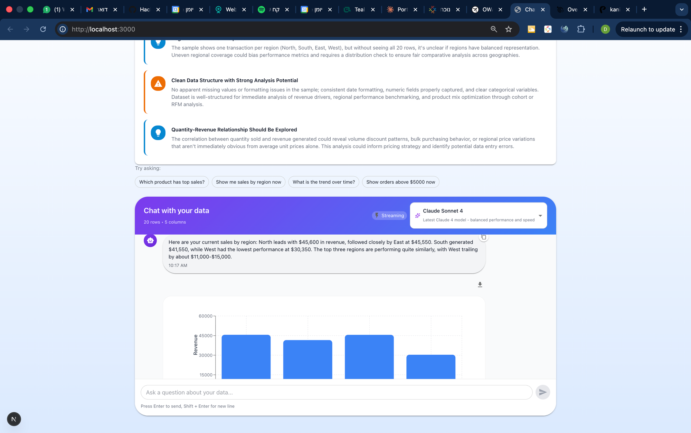

# AI Data Analysis Tool

An intelligent data analysis tool that combines natural language queries with automatic visualizations. Upload your Excel files, ask questions in plain English, and get instant insights with beautiful charts.




## ✨ Features

- 📊 **Excel File Analysis** - Upload .xlsx/.xls files and query your data instantly
- 🤖 **AI-Powered Insights** - Claude AI understands your questions and generates intelligent responses
- 🎛️ **Model Selection** - Choose from available Claude models based on your API access
- 📈 **Automatic Visualizations** - AI selects the best chart type (bar, pie, line, scatter, table)
- 💾 **Download Charts** - Export visualizations as PNG images or CSV data
- 🔄 **Streaming Responses** - ChatGPT-style word-by-word text generation
- 💬 **Conversation Memory** - Ask follow-up questions with context awareness
- 🎨 **Modern UI** - Beautiful, responsive interface built with Material-UI
- ⚡ **Real-Time Processing** - Get answers in seconds

## 🚀 Quick Start

### Prerequisites

- Node.js 18+
- Anthropic API key ([Get one here](https://console.anthropic.com/))

### Installation

1. **Clone the repository:**
   ```bash
   git clone https://github.com/DorKaminsky/ai-data-analysis-tool.git
   cd ai-data-analysis-tool
   ```

2. **Install dependencies:**
   ```bash
   npm install
   ```

3. **Set up your API key:**

   Create `.env.local` file:
   ```bash
   ANTHROPIC_API_KEY=your_api_key_here
   ```

4. **Start the development server:**
   ```bash
   npm run dev
   ```

5. **Open your browser:**
   ```
   http://localhost:3000
   ```

## 📖 How to Use

1. **Upload Your Data**
   - Click or drag-and-drop an Excel file (.xlsx or .xls)
   - The system will analyze your data structure automatically
   - You'll see a preview of your columns and data

2. **Ask Questions**
   - Type questions in plain English
   - Click example queries to get started
   - Examples:
     - "Which product generated the most revenue?"
     - "Show me sales by region"
     - "What's the trend over time?"

3. **Get Insights**
   - Receive intelligent text responses
   - View automatic visualizations
   - Ask follow-up questions

## 🏗️ Architecture

### Tech Stack

- **Frontend:** Next.js 16 (App Router), React 19, Material-UI 6
- **Backend:** Next.js API Routes
- **AI:** Claude models (Sonnet 4, 3.5 Sonnet) via Anthropic SDK
- **Data Processing:** xlsx library for Excel parsing
- **Visualizations:** Recharts
- **Type Safety:** TypeScript
- **Validation:** Zod

### Two-Phase LLM Approach

```
User Query
    ↓
┌─────────────────────────────────┐
│ Phase 1: Query Analysis         │
│ - Understand intent             │
│ - Identify required data        │
│ - Determine aggregation         │
│ - Decide visualization need     │
└─────────────────────────────────┘
    ↓
Data Filtering & Aggregation
    ↓
┌─────────────────────────────────┐
│ Phase 2: Response Generation    │
│ - Generate text answer          │
│ - Select chart type             │
│ - Create data mapping           │
└─────────────────────────────────┘
    ↓
Display: Text + Chart
```

### Project Structure

```
/
├── app/
│   ├── api/
│   │   ├── chat-stream/route.ts   # Streaming chat endpoint (primary)
│   │   ├── chat/route.ts          # Non-streaming fallback endpoint
│   │   ├── models/route.ts        # Model detection endpoint
│   │   ├── insights/route.ts      # Smart insights endpoint
│   │   └── data/upload/route.ts   # File upload endpoint
│   ├── layout.tsx                 # Root layout with MUI theme
│   ├── page.tsx                   # Main application page
│   └── globals.css                # Global styles
├── components/
│   ├── ChatInterface.tsx          # Chat UI with streaming
│   ├── Message.tsx                # Message display with markdown
│   ├── FileUpload.tsx             # Drag-drop file upload
│   ├── ChartRenderer.tsx          # Chart visualization with download
│   ├── SmartInsights.tsx          # AI-powered data insights
│   └── SuccessConfetti.tsx        # Celebration animations
├── lib/
│   ├── llm-service.ts             # Claude API integration (streaming + non-streaming)
│   ├── data-service.ts            # Excel parsing & in-memory storage
│   ├── chart-spec-generator.ts    # Chart data transformation
│   └── types.ts                   # TypeScript interfaces
├── public/
│   └── sample-sales-data.xlsx     # Sample dataset (20 rows)
├── CLAUDE.md                      # Development guide for Claude Code
└── README.md                      # This file
```

## 🎯 Example Queries

Try these questions with the sample data:

- **Comparison:** "Which product sold the most?"
- **Proportions:** "Show sales percentage by region as a pie chart"
- **Trends:** "What's the revenue trend over time?"
- **Filtering:** "Show all orders above $7000"
- **Aggregation:** "What's the average revenue per region?"

## 🔧 Development

### Available Scripts

```bash
npm run dev     # Start development server
npm run build   # Build for production
npm start       # Start production server
npm run lint    # Run ESLint
```

### Environment Variables

| Variable | Description | Required |
|----------|-------------|----------|
| `ANTHROPIC_API_KEY` | Your Anthropic API key | Yes |
| `NODE_ENV` | Environment (development/production) | No |

### API Endpoints

#### POST /api/data/upload
Upload and parse Excel files.

**Request:**
- Content-Type: `multipart/form-data`
- Body: `file` (Excel file)

**Response:**
```json
{
  "dataSourceId": "uuid",
  "fileName": "data.xlsx",
  "schema": {
    "columns": [
      {"name": "Product", "type": "string", "sample": ["A", "B", "C"]},
      {"name": "Revenue", "type": "number", "sample": [1000, 2000, 3000]}
    ],
    "rowCount": 100
  },
  "preview": [/* first 5 rows */]
}
```

#### POST /api/chat-stream
Process natural language queries with streaming (primary endpoint).

**Request:**
```json
{
  "query": "Which product sold most?",
  "dataSourceId": "uuid",
  "conversationHistory": [
    {"role": "user", "content": "Previous question"},
    {"role": "assistant", "content": "Previous answer"}
  ],
  "model": "claude-sonnet-4-20250514"
}
```

**Response:** Server-Sent Events (SSE) stream
```
data: {"type":"status","message":"Analyzing..."}
data: {"type":"text","content":"Product"}
data: {"type":"text","content":" A"}
data: {"type":"visualization","data":{...}}
data: {"type":"done"}
```

#### POST /api/chat
Non-streaming fallback endpoint (same request/response structure)

## 🎨 Chart Types

The AI automatically selects the best visualization:

| Chart Type | Use Case | Example Query |
|------------|----------|---------------|
| **Bar Chart** | Compare categories | "Which product sold most?" |
| **Pie Chart** | Show proportions | "Sales % by region?" |
| **Line Chart** | Trends over time | "Revenue over months?" |
| **Scatter Plot** | Correlations | "Price vs quantity relationship?" |
| **Table** | Raw filtered data | "Show orders over $5000" |

All charts support:
- 📥 **Download as PNG** - High-quality image export
- 📄 **Download as CSV** - Raw data export

## 🐛 Troubleshooting

### "Model not available" error
- The app automatically detects available models based on your API key
- If no models appear, check your Anthropic account tier and API key
- Verify `ANTHROPIC_API_KEY` is set in `.env.local`

### "Data source not found" error
- Upload a file first before querying
- Ensure the upload was successful (green confirmation)

### Charts not rendering
- Check browser console for errors
- Verify data format matches chart requirements

## 🤝 Contributing

This is an educational project. Feel free to:
- Report bugs
- Suggest features
- Submit pull requests

## 📝 Model Note

This project was designed to use Claude Opus 4.6 as specified in the original requirements. However, due to API tier limitations, the implementation uses **Claude Sonnet 4** (`claude-sonnet-4-20250514`) as the primary model, with fallback to Claude 3.5 Sonnet.

The architecture is model-agnostic and supports any Claude model. To use Opus 4.6 when available, simply update the model ID in `lib/llm-service.ts:34`.

## 📄 License

MIT

## 📚 Documentation

See [CLAUDE.md](CLAUDE.md) for detailed development documentation including:
- Architecture overview
- Two-phase LLM processing
- Server-Sent Events streaming
- API endpoint specifications
- Common patterns and examples

## 🙏 Acknowledgments

- **Claude AI** by Anthropic for AI capabilities
- **Next.js** for the full-stack framework
- **Material-UI** for beautiful components
- **Recharts** for visualization library
- **Built with Claude Code** - AI-assisted development

---

**Built as a demonstration of AI-powered data visualization** 🚀

